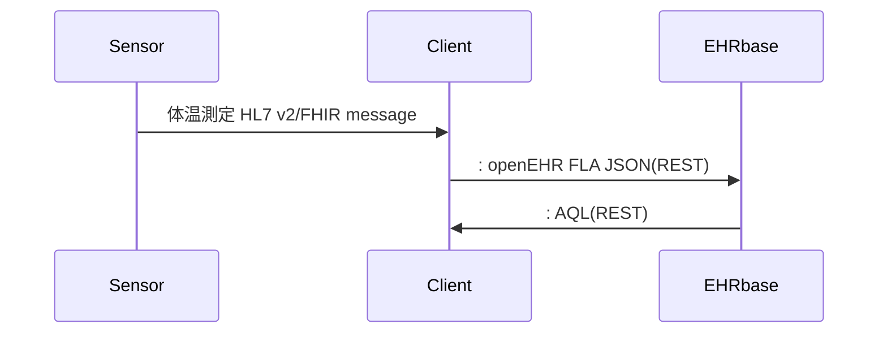

# 第1回openEHR tutorial 2022

2022年のチュートリアルでは、体温のモニタリングとその記録についてopenEHRを中心にモデリングを行いEHRbaseを使って実装していきます。


## システム構成図

モデルとなるシステムの構成を下に示します。Sensorは皮膚表面から体温を測定し、HL7 v2 messageあるいはFHIRでClientに送り、Clientは読み取ったデータをEHRbaseにopenEHR FLAT JSON形式でデータを送付して保存します。かんたんにするために、同じ患者でのデータで表現します。



シークエンス図


## 体温データ

体温は36.1℃と数値と単位で示されます。しかし、測定部位や方法により体温についての解釈も変わります。データとしてはできるだけ正確であったほうがいいので、測定部位を皮膚として記録することにします。

## HL7 v2形式

HL7 v2ではOBXレコードを使って検査データやバイタルサインとして測定されたデータを表現します。以下がその例です。

```
OBX|1|NM|^体温||36.8|Cel|||||F|||20220225202523||||
```

### 用語の標準化

このメッセージは「2022年2月25日0時25分3秒に体温 36.8℃と測定した」というメッセージを表しています。
１施設での運用であればこれで構いませんが、「体温」と同じような意味を表す言葉はたくさんあります。

 * 皮膚温
 * 温度
 * Temperature
 * Body temperature

データを有効活用するためには標準用語集を利用することが推奨されています。体温を表す用語は[LOINC](https://loinc.org/)では以下のように決められています。

 * 用語集: LOINC(HL7 tableでLN)
 * コード: 8310-5
 * 名称: Body temperature

先程のHL7 V2メッセージをLOINCで標準化すると以下のようになります

```
OBX|5|NM|8310-5^Body temperature^LN||36.8|Cel|||||F|||20220225202523||||
```

### HL7 FHIRメッセージ

[HL7 FHIR](https://www.hl7.org/fhir/)ではResourceと呼ばれるデータモデルを使ってデータを表現します。XMLやJSONなどで表現し、REST APIを使ってデータ交換します。検査やバイタルサインは[Observation](https://www.hl7.org/fhir/observation.html) Resourceで表現します。

先程の体温を[FHIR](https://www.hl7.org/fhir/)で表現すると下記のようになります。

```json
{
  "resourceType": "Observation",
  "id": "body-temperature",
  "meta": {
    "profile": [
      "http://hl7.org/fhir/StructureDefinition/vitalsigns"
    ]
  },
  "status": "final",
  "code": {
    "coding": [
      {
        "system": "http://loinc.org",
        "code": "8310-5",
        "display": "Body temperature"
      }
    ]
  },
  "effectiveDateTime": "2022-02-25T20:25:23",
  "valueQuantity": {
    "value": 36.5,
    "unit": "C",
    "system": "http://unitsofmeasure.org",
    "code": "Cel"
  }
}

```

どちらの形式を使うかは状況によります。HL7 Ver 2もFHIRも形式を変更することなく用語を変えることで様々なデータを取り扱うことができますが、それだけに標準用語集を使うことが望まれます。

## openEHR Archetype/Template

openEHRではObservationクラスでさまざまなデータモデルを表現します。体温についてもデータモデルがありますので、それを利用します

 * [Body Temperature](https://ckm.openehr.org/ckm/archetypes/1013.1.2796)

openEHRではどのような場面でも適応できるように最大データセットを取り入れるようモデル設計が行われています。実際にはそのすべての項目を使うことはなく、その中で必要な項目を使うようにtemplateで指定します。Archetypeに必要な項目がない場合はそのArchetypeを特殊化して項目を足すこともできます。

Template/archetypeの編集はArchetype Designer, Health Modeling CollaborationやTemplate Designerで行います。

 * [Archetype Designer](https://tools.openehr.org/designer/)
 * [Health Modeling Collaboration](http://hmc.openehr.org.cn/#/archetype)
 * [Ocean Template Designer](http://downloads.oceaninformatics.com/downloads/TemplateDesigner/)


Templateは実際の帳票や画面をもとに作成します。今回は[Archetype Designer](https://tools.openehr.org/designer/)を利用します。


